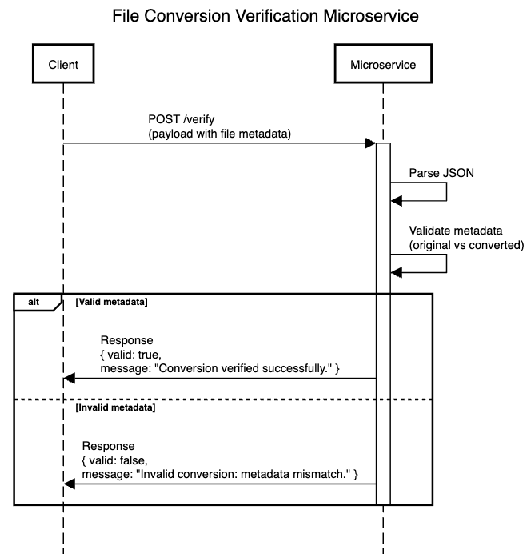

# verify-conversion-microservice

## Microservice A - File Conversion Verifier

This microservice handles file conversion verification requests. It validates whether the converted file matches the expected metadata from the original file. If the file format and filenames match, it returns a success message. Otherwise, it indicates a mismatch.

## Requesting and Receiving Data

To call this microservice, send a POST request to:
http://localhost:3001/verify


# Start the microservice
node index.js
Testing the Microservice

# Install Axios if not already installed
npm install axios

# In a separate terminal, run the test client
node testClient.js

## UML Sequence Diagram



### Example Payload
```json
{
  "operation": "verify",
  "app_id": "cyrus",
  "files": {
    "original": {
      "file_name": "test_original.pdf",
      "source": "uploads/folder1"
    },
    "converted": {
      "file_name": "test_converted.csv",
      "destination": "uploads/folder1/converted",
      "format": "csv",
      "conversion_time": "2025-08-01T10:30:00Z"
    }
  }
}


{
  "valid": true,
  "message": "Conversion verified successfully."
}

{
  "valid": false,
  "message": "Invalid conversion: metadata mismatch."
}


